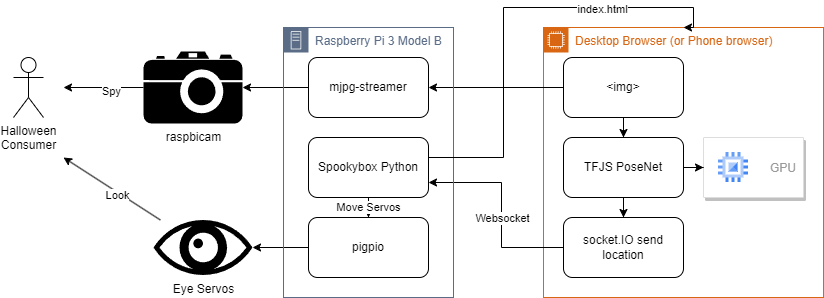

# What is this?
It's a spooky box version 2!

# What's going on here?

Spookyboxv1 used OpenCV running on the Raspberry Pi 3, however, this was way to underpowered for what I was attempting to do. Spookyboxv2 offloads all the face detecting to a desktop or phone browser with an attached GPU or AI accelleration (in a phone) and can do this MUCH faster and more accurately with Tensorflow JS and PoseNet.

Maybe this diagram might help? Maybe it just makes things more confusing.

# Running it
These are my rough notes so I remember what to do for Halloween 2023.

1. Get a raspberry pi and camera module, and servos
1. 3D print the freecad models
1. Git clone this in to /home/pi/src/
1. Run install.sh
1. Get spooky.
1. Open a browser on a mobile or desktop device to http://spookyboxpi.local:5000/static/index.html