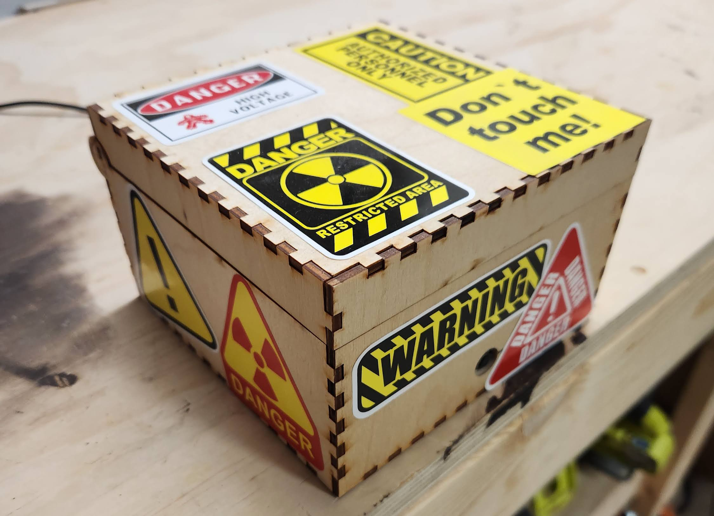
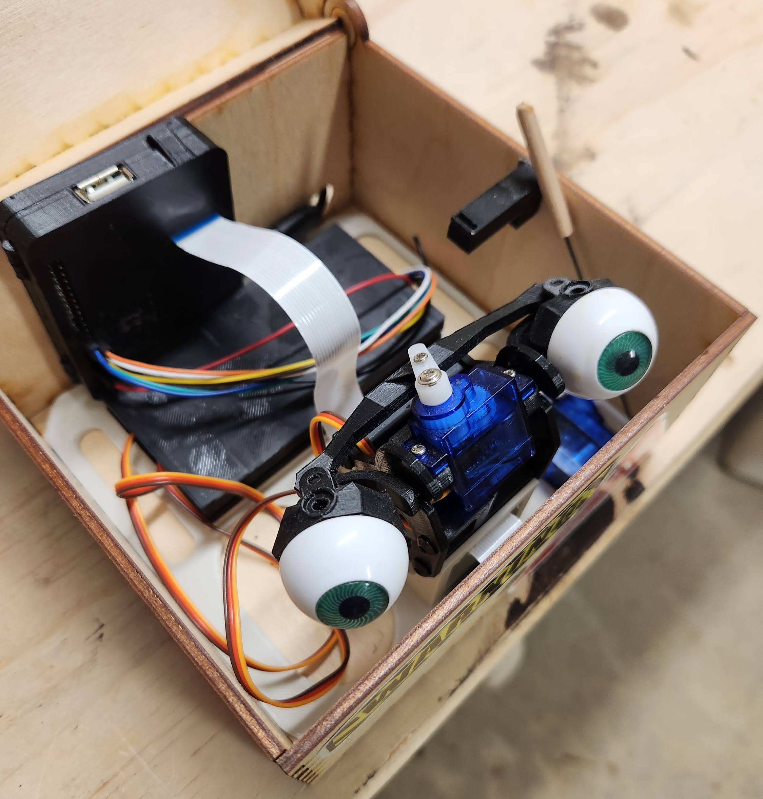

# What is this?
It's a spooky box version 3! For 2023 it's no longer in a pumpkin, but back in it's box. Version 1 was in a box and that's how it got it's name and we're back to continuing the tradition. You can check out what the 2021 version did [here](https://github.com/ryanbeales/spookybox/tree/spookyboxv1) and 2023 [here](https://github.com/ryanbeales/spookybox/tree/spookyboxv2).

This is some face tracking which is then used as an input to drive some servos that direct some fake plastic eyeballs to follow people around. All this to hopefully spook our Halloween vistors. Success rate so far is about 10% of kids spooked in both 2021 and 2022. 2023 upped this to a better 30%. 2024 really needs to terrify people...

Here's a video of it working:
<iframe width="560" height="315" src="https://www.youtube.com/embed/ynq5hFvTToc?si=sWmAWYoa3XNeTq9R&amp;controls=0" title="YouTube video player" frameborder="0" allow="accelerometer; autoplay; clipboard-write; encrypted-media; gyroscope; picture-in-picture; web-share" allowfullscreen></iframe>

For 2023 it was mostly UI improvementsm so here's a video of the UI:
<iframe width="560" height="315" src="https://www.youtube.com/embed/F0AnC8ocOAw?si=0ItB65YGGd9QZK_W" title="YouTube video player" frameborder="0" allow="accelerometer; autoplay; clipboard-write; encrypted-media; gyroscope; picture-in-picture; web-share" allowfullscreen></iframe>

The red dot will aim where it finds a face. Posenet is pretty good at finding faces, what is not good is me trying to make a single point out of that. It should be finding the top left corner of the bounding box of the face it finds. It's not quite doing that. But better than nothing! For 2023 i've added some manual controls and some tuning for the lid servo open/close points so we can get that satisfying slap when it closes. There's a manual lid control option which will keep the eyes tracking whatever it finds.

# What's going on here?

Spookyboxv1 used OpenCV running on the Raspberry Pi 3, however, this was way to underpowered for what I was attempting to do. 
Spookyboxv2 offloaded all the face detecting to a desktop or phone browser with an attached GPU or AI accelleration (in a phone) and can find faces/ears/noses/eyes MUCH faster and more accurately with Tensorflow JS and PoseNet.
Spookyboxv3 much the same as v2, but software improvements and back to the box.

Maybe this diagram might help? Maybe it just makes things more confusing.

# Parts needed/used

- Monkmakes Servosix
- 3 Servos
- Bits'o'wire
- Random amazon plastic eyes
- 1 metal rod
- Glue
- 3D print of ./freecad_models/Spookybox2023-2.FCStd (designed to fit everything below)
- 3D print of ./freecad_models/ServoSixCase.FCStd
- 3D print of [Raspberry Pi 3 Model A+ Case](http://www.thingiverse.com/thing:3683365)
- 3D print of [Raspberry pi camera case/enclosure](https://www.thingiverse.com/thing:92208)
- 3D print of [Dasaki Compact Animatronic Eyes](https://www.thingiverse.com/thing:266765)
- A box
- Some small screws for the animatronic eyes
- Raspberry Pi 3 Model A+
- Raspbicam
- SD Card
- Power supply
- Some more powerful hardware to drive it (a semi-recent phone will do, or a Nvidia 4090)

# Assembly photos

A view of the outside:
  

And the inside:
  

The raspbicam has a little hole to peek through the box, harder to see with all the stickers. The lid servo is using a small metal rod with a dowel on the end to make better contact with an old 3D printed part that is glued to the lid.

# Running it
These are my rough notes so I remember what to do for Halloween 2024.

1. Get a raspberry pi and camera module, and servos
1. 3D print all the parts
1. Git clone this in to /home/pi/src/
1. Run install.sh
1. Get spooky.
1. Open a browser on a mobile or desktop device to http://spookyboxpi.local:5000/static/index.html

# TODO

- Increased spookyness (Speakers and some AI voice cloning? Smoke machine?)
- Some sort of CI/CD to pull new changes of the UI down (that's taking my day job home...)
- Add more power. Sometimes the lid servo can consume all the power so the eyes get stuck.