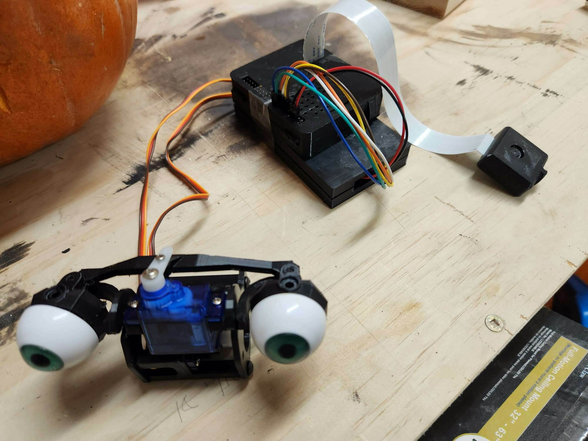
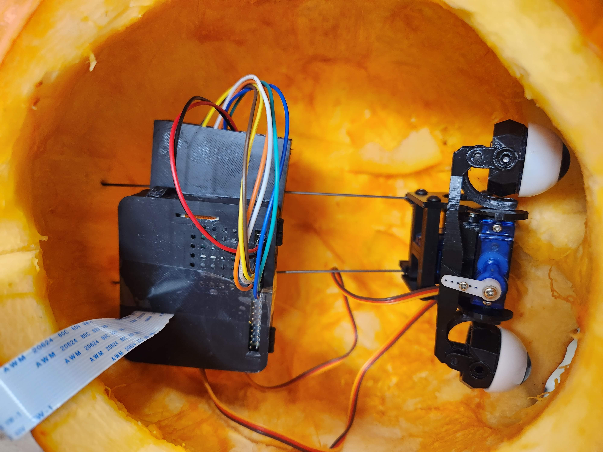
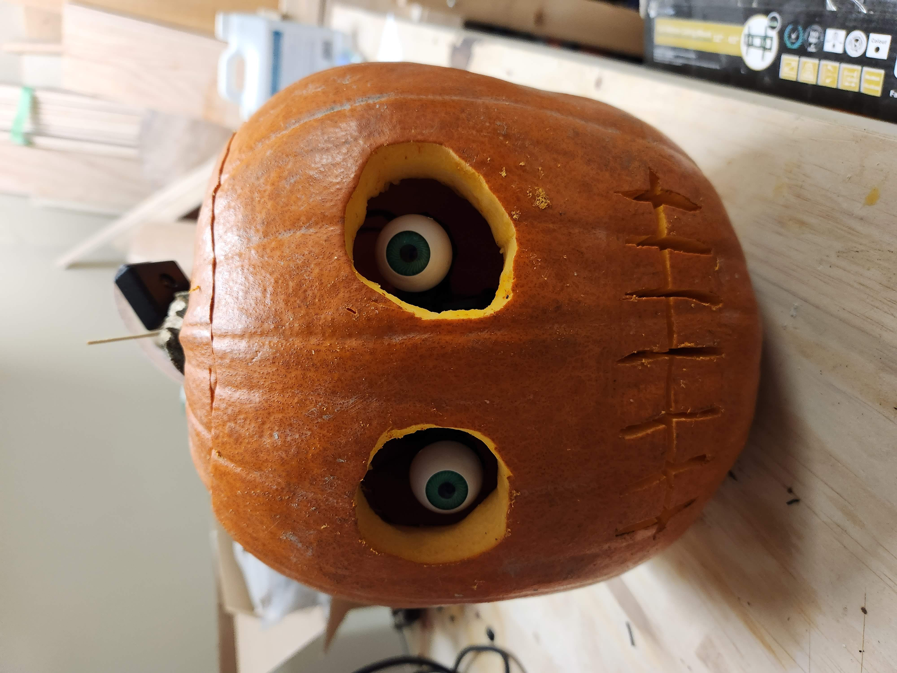

# What is this?
It's a spooky box version 2! For 2022 it's in a pumpkin! So not really a box. Version 1 was in a box and that's how it got it's name, now we're stuck with it. You can check out what the 2021 version did [here](https://github.com/ryanbeales/spookybox/tree/spookyboxv1)

This is some face tracking which is then used as an input to drive some servos that direct some fake plastic eyeballs to follow people around. All this to hopefully spook our Halloween vistors. Success rate so far is about 10% of kids spooked in both 2021 and 2022. 2023 plans are already being formed for even more spookyness (add a speaker? maybe put it in a creepy painting?)

Here's a video of it working:

# What's going on here?

Spookyboxv1 used OpenCV running on the Raspberry Pi 3, however, this was way to underpowered for what I was attempting to do. Spookyboxv2 offloads all the face detecting to a desktop or phone browser with an attached GPU or AI accelleration (in a phone) and can find faces/ears/noses/eyes MUCH faster and more accurately with Tensorflow JS and PoseNet.

Maybe this diagram might help? Maybe it just makes things more confusing.

# Parts needed/used

- Monkmakes Servosix
- 2 Servos
- Bits'o'wire
- Random amazon plastic eyes
- 2 metal rods
- Glue
- 3D print of ./freecad_models/PumpkinEyeMount.FCStd
- 3D print of ./freecad_models/ServoSixCase.FCStd
- 3D print of [Raspberry Pi 3 Model A+ Case](http://www.thingiverse.com/thing:3683365)
- 3D print of [Raspberry pi camera case/enclosure](https://www.thingiverse.com/thing:92208)
- 3D print of [Dasaki Compact Animatronic Eyes](https://www.thingiverse.com/thing:266765)
- Some small screws for the animatronic eyes
- Raspberry Pi 3 Model A+
- Raspbicam
- SD Card
- Power supply

# Assembly photos

Fully assembled parts:

Mounted inside the pumpkin using two metal rods to suspend everything above the pumpkin and it's juices:

View of outside of the pumpkin:

# Running it
These are my rough notes so I remember what to do for Halloween 2023.

1. Get a raspberry pi and camera module, and servos
1. 3D print all the parts
1. Git clone this in to /home/pi/src/
1. Run install.sh
1. Get spooky.
1. Open a browser on a mobile or desktop device to http://spookyboxpi.local:5000/static/index.html